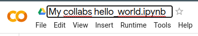

**Tutorial Penggunaan Google Collabs**

1. **Membuat file baru**

1. Pastikan untuk sudah login ke akun google masing-masing. Dan disarankan menggunakan browser google chrome.
1. Lalu buka url “<https://colab.research.google.com/>” .

1. Setelah itu website akan menampilkan popup seperti beriku.

Klik **New notebook**.

1. Setelah itu website akan beralih kemode editor seperti berikut.

Pada halaman inilah untuk tempat penulisan kode python. Untuk menambahkan cell baru dapat dengan menekan tombol  **+ Code untuk** cell code. Sedangkan untuk cell text dapat menekan tombol **+ Text**.

1. **Menjalankan program**

Untuk menjalankan kode program adalah dengan menekan tombol play pada tiap sisi kiri cell seperti berikut.

Setelah itu program akan menampilkan hasilnya dibawah setiap cell seperti berikut.

Atau jika pengguna ingin menjalankan semua cell sekaligus, pengguna dapat menekan tombol **Runtime > Run All**.

1. **Rename dan save program**

Untuk melakukan rename file, pengguna dapat dengan menekan langsung nama file dibagian header lalu menuliskan langsung nama file baru diikuti dengan extension .ipynb seperti berikut ini.

Menjadi 

Untuk menyimpan program, pengguna dapat menekan tombol **ctrl + s** atau dengan menekan tombol **File > Save.**

Untuk mengunduh program yang telah dibuat, pengguna dapat menekan tombol **File > Download > Format yang diinginkan**.

1. **Unggah File**

Untuk menggunggah file ke google collabs, pengguna dapat menekan tombol Files yang terletak disamping kiri website seperti beriktu.

Kemudian untuk mengunggah file dari lokal, pengguna dapat menekan tombol  File dengan tanda panah keatas yang terletak pada samping kiri seperti berikut. 

Untuk mengambil file dari google drive, pengguna dapat menekan tombol folder drive yang terletak di sebelah kanan .

