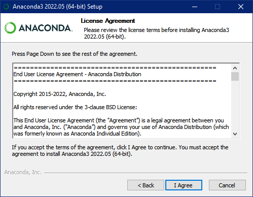

1. Kunjungi <https://www.anaconda.com/> kemudian download installer Anaconda

1. Buka file Anaconda3-2022.05-Windows-x86\_64.exe

1. Tekan tombol “Next” untuk lanjut ke instalasi

1. Klik “Next” untuk menyetujui syarat dan ketentuan anaconda

1. Tentukan profil mana yang akan menggunakan anaconda lalu klik “Next” untuk melanjutkan 

1. Pilih lokasi instalasi Anaconda

1. Tentukan apakah anda ingin menambahkan anaconda ke dalam lingkungan variabel PATH. Dengan menambahkan anaconda ke dalam lingkungan variabel PATH, anda dapat memanggil anaconda melalui command prompt (CMD). Kemudian tunggu hingga proses instalasi selesai.

1. Klik “Next” untuk melanjutkan

1. Setelah menyelesaikan semua tahapan instalasi anaconda, anda akan melihat tampilan “Thanks for installing Anaconda”. Tekan finish untuk menutup program instalasi anaconda

